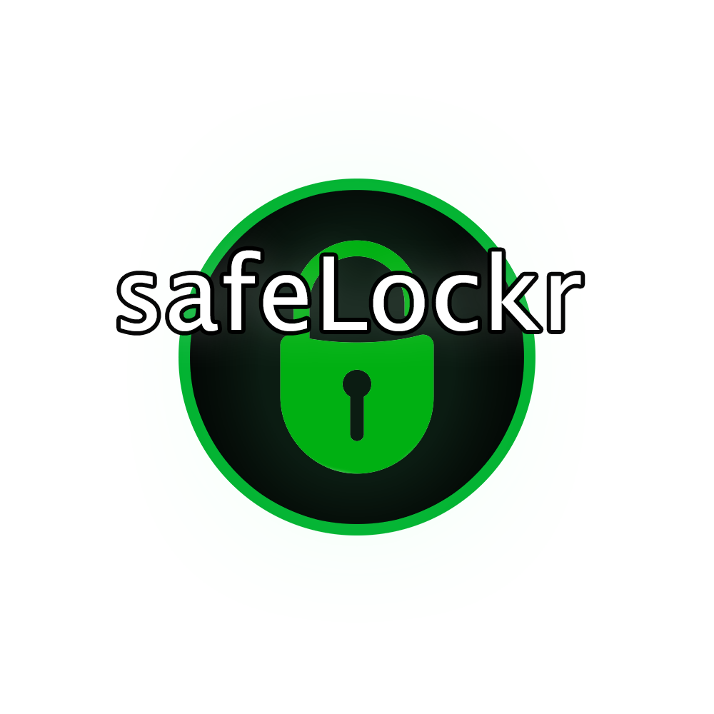

### Secure Your Information with Ease

---

**safeLockr** is a simple and concise web API for encrypting and decrypting a single string of input. It does so by a combination of Caesar-cipher and randomization. **safeLockr** ensures your information remains confidential and secure.

# Local use

### 🔒 How to encrypt 🔒

- Create a new folder, open a terminal, navigate to that folder in your terminal, and run the command `git clone https://github.com/SodenSys/safeLockr.git` in your terminal.
- Open the entire root folder for the new cloned repository, called 'safeLockr', in your IDE of choice (VS Code, Eclipse, Jetbrains Rider, etc).
- In the terminal of your IDE, navigate to the subfolder 'safeLockr' (../safeLockr/safeLockr/) and type `dotnet run`. The API will build, launch, and display a URL-address (localhost). Note that the crosses are to be replaced with your port number!
- Open your localhost-URL, add /home after it, then click the top link to reach the encryption API.
- Add the input you want to encrypt right after the '=' in the URL.

### 🔓 How to decrypt 🔓

- Follow the first three steps above if you haven't already.
- Open your localhost-URL, add /home after it, then click the bottom link to reach the decryption API.
- Add the input you want to decrypt, at the end, right after the '=' in the URL.

# Online use (NO LONGER ONLINE, ONLY LOCAL USE AVAILABLE)

---

### 🛠️Testing🛠️

If you'd like to run the XUnit test connected to the API, you can do so locally via the `dotnet test` command in the terminal of your IDE. Make sure you are in the 'safeLockr.tests' subfolder (../safeLockr/safeLockr.tests/) when you do so, otherwise it will just restore the 'safeLockr' project which does nothing.